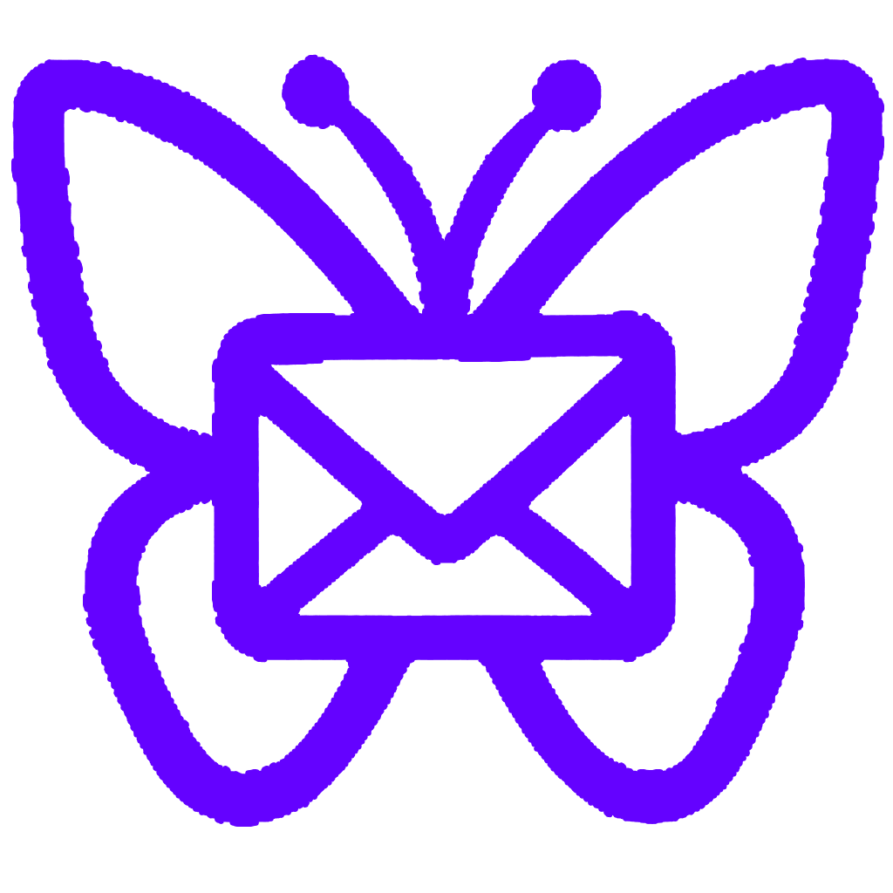
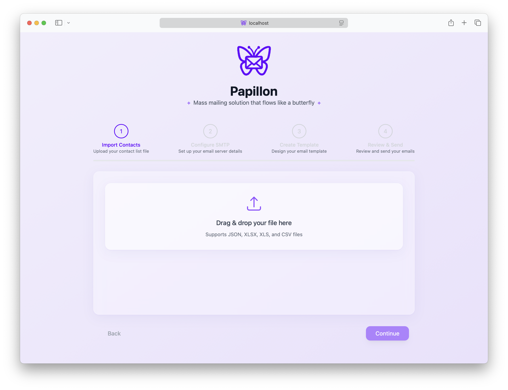

# 🦋 Papillon Mailler

<div align="center">
  
  <p><em>A beautiful mass mailing solution that flows like a butterfly</em></p>
</div>

> ⚠️ **WARNING**: This application is a proof of concept that was quickly developed without comprehensive testing or security audits. It is NOT recommended for production use.

## 🌟 Overview

Papillon Mailler is an elegant and simple email automation tool that combines beautiful design with robust functionality. Built with React and TypeScript, it offers a modern, intuitive interface for managing mass email campaigns while maintaining a personal touch through customizable templates.

  

## ✨ Features

- **🎨 Modern UI/UX**
  - Glass morphism design
  - Smooth flowing animations
  - Responsive layout
  - Dark mode support

- **📧 Email Campaign Management**
  - Bulk email sending
  - Custom variable support
  - HTML template builder
  - Preview functionality

- **📊 Contact Management**
  - Support for multiple file formats:
    - Excel (XLSX, XLS)
    - CSV
    - JSON
  - Drag-and-drop file upload
  - Contact field mapping

## 🚀 Getting Started

### Prerequisites

- Node.js (v18 or higher)
- npm or yarn

### Quick Installation

```bash
# Clone the repository
git clone https://github.com/matissime/papillon-mailler.git

# Navigate to project directory
cd papillon-mailler

# Install and start (automatically installs dependencies and starts both servers)
npm run quick-start
```

### Manual Installation

```bash
# Install dependencies
npm install

# Start development servers
npm run dev      # Frontend only
npm run server   # Backend only
npm start        # Both frontend and backend
```

## 💻 Usage

### 1. Prepare Contact List

Format your contact list as XLSX, CSV, or JSON with columns. The first row contains the keys (only 'email' is required), and subsequent rows contain the corresponding values:

| email             | name      | company   | role       | customField |
|------------------|-----------|-----------|------------|-------------|
| john@example.com | John Doe  | Acme Inc  | Developer  | Value 1     |
| sarah@example.com| Sarah Lee | TechCorp  | Designer   | Value 2     |

Each column header (except 'email') becomes a variable that you can use in your email template with {{variableName}} syntax.

### 2. Create Email Template

Use the column names as variables in your templates:

```html
Subject: Welcome to {{company}}!

<h1>Hello {{name}},</h1>
<p>We're excited to have you as our {{role}}...</p>
```

## 🛠️ Development

### Project Structure

```
papillon-mailler/
├── public/           # Static assets
├── src/
│   ├── components/  # React components
│   ├── utils/       # Utility functions
│   ├── types/       # TypeScript definitions
│   └── assets/      # Images and styles
├── server.js        # Express backend
└── vite.config.ts   # Vite configuration
```

### Technologies Used

- **Frontend:**
  - React 18
  - TypeScript
  - Tailwind CSS
  - Vite

- **Backend:**
  - Express
  - Node.js
  - Nodemailer

- **Tools & Libraries:**
  - XLSX Parser
  - React Dropzone
  - React Hot Toast
  - Headless UI

## 🤝 Contributing

We welcome contributions to Papillon Mail! Please follow these steps:

1. Fork the repository
2. Create a new branch: `git checkout -b feature/amazing-feature`
3. Make your changes and commit: `git commit -m 'Add amazing feature'`
4. Push to your fork: `git push origin feature/amazing-feature`
5. Open a Pull Request

## 📝 License

This project is licensed under the MIT License - see the [LICENSE.md](LICENSE.md) file for details.

## 💬 Support

- Create an issue for bug reports or feature requests
- Star the repository if you find it useful
- Fork the project to create your own version
- Contact us at support@example.com for direct assistance

## 🙏 Acknowledgments

- Icons provided by [Heroicons](https://heroicons.com)
- UI components from [Headless UI](https://headlessui.dev)
- Inspired by modern email automation tools

---

<div align="center">
  <p>Made with ❤️ by Matisse</p>
</div>
